# GLO CRM Database - Entity Relationship Diagram

## Database Overview
This ERD represents the complete database structure for the GLO Real Estate CRM system with property classification and user access control.

```mermaid
erDiagram
    %% User Management & Authentication
    USER {
        int id PK
        string username
        string email
        string first_name
        string last_name
        string password
        string role "manager|sales|agent|employee"
        string property_access "all|commercial|residential|none"
        string department
        string phone
        boolean is_superuser
        boolean is_staff
        boolean is_active
        datetime created_at
        datetime updated_at
        datetime last_login
        datetime date_joined
    }

    AUDIT_LOG {
        int id PK
        int user_id FK
        string action "CR|UP|DE|LI|LO|VW"
        string model_name
        string record_id
        json changes
        datetime timestamp
        string ip_address
        text description
    }

    %% Management System
    PERMISSION {
        int id PK
        string name
        string codename
        string permission_type "view|add|change|delete|manage|export|import|admin|bulk_action|field_access"
        string module "leads|opportunities|properties|accounts|management|reports|core|dashboard"
        string model_name
        json allowed_fields
        json restricted_fields
        text description
        json conditions
        boolean is_active
        datetime created_at
        datetime updated_at
    }

    ROLE {
        int id PK
        string name
        text description
        boolean is_active
        int created_by_id FK
        datetime created_at
        datetime updated_at
    }

    ROLE_PERMISSIONS {
        int id PK
        int role_id FK
        int permission_id FK
    }

    TEAM {
        int id PK
        string name
        int manager_id FK
        text description
        boolean is_active
        int created_by_id FK
        datetime created_at
        datetime updated_at
    }

    TEAM_MEMBERSHIP {
        int id PK
        int team_id FK
        int user_id FK
        int role_id FK
        boolean is_manager
        date joined_at
        date left_at
    }

    USER_PROFILE {
        int id PK
        int user_id FK "OneToOne"
        int role_id FK
        string employee_id
        string phone
        string department
        string position
        int manager_id FK
        string status "active|inactive|suspended|pending"
        text bio
        string avatar
        json preferences
        datetime created_at
        datetime updated_at
    }

    %% Property Management System
    PROPERTY_CLASSIFICATION {
        int id PK
        string name "commercial|residential"
        text description
        datetime created_at
        datetime updated_at
    }

    PROPERTY_TYPE {
        int id PK
        string name "Apartment|Villa|Office|Shop|Medical|etc"
        datetime created_at
        datetime updated_at
    }

    COMPOUND {
        int id PK
        string name
        datetime created_at
        datetime updated_at
    }

    PROJECT {
        int id PK
        string name
        datetime created_at
        datetime updated_at
    }

    REGION {
        int id PK
        string name
        datetime created_at
        datetime updated_at
    }

    FINISHING_LEVEL {
        int id PK
        string name
        datetime created_at
        datetime updated_at
    }

    CURRENCY {
        int id PK
        string code "USD|EGP|EUR"
        string symbol "$|£|€"
        datetime created_at
        datetime updated_at
    }

    CATEGORY {
        int id PK
        string name
        datetime created_at
        datetime updated_at
    }

    STATUS {
        int id PK
        string name
        datetime created_at
        datetime updated_at
    }

    OFFERED_BY {
        int id PK
        string name
        datetime created_at
        datetime updated_at
    }

    PROPERTY {
        int id PK
        uuid property_id
        int building
        string property_number
        int the_floors
        text unit_features
        int phase
        text note
        string in_or_outside_compound "inside|outside"
        text description
        date last_follow_in
        int status_id FK
        int property_offered_by_id FK
        string name
        string unit_no
        date call_update
        int handler_id FK
        int sales_id FK
        datetime created_at
        datetime updated_at
        decimal land_area
        date rent_from
        date rent_to
        int compound_id FK
        boolean liked
        boolean in_home
        int rooms
        string mobile_no
        string tel
        decimal total_price
        decimal price_per_meter
        text property_image
        text videos
        int project_id FK
        decimal installment
        string payed_every "monthly|quarterly|semiannual|annual"
        decimal monthly
        decimal down_payment
        decimal space_unit
        decimal space_guard
        string location
        int region_id FK
        int property_type_id FK
        int classification_id FK
        int finishing_id FK
        int currency_id FK
        int category_id FK
        string activity
        decimal built_area
        int bedrooms_count
    }

    PROPERTY_IMAGE {
        int id PK
        int property_id FK
        string image
        string caption
        boolean is_primary
        int order
        datetime uploaded_at
    }

    PROPERTY_DOCUMENT {
        int id PK
        int property_id FK
        string document_type "DD|PL|PM|IN|CT|OT"
        string file
        string title
        text description
        int uploaded_by_id FK
        datetime uploaded_at
    }

    %% Lead Management System
    LEAD_SOURCE {
        string lead_source_id PK
        string name
        text description
        boolean is_active
        datetime created_at
        datetime updated_at
    }

    LEAD_STATUS {
        string lead_status_id PK
        string name
        text description
        string color
        boolean is_active
        datetime created_at
        datetime updated_at
    }

    LEAD_PRIORITY {
        string lead_priority_id PK
        string name
        int level
        string color
        boolean is_active
        datetime created_at
        datetime updated_at
    }

    LEAD {
        string lead_id PK
        string lead_number
        string name
        string email
        string phone
        text address
        string lead_source_id FK
        string status_id FK
        string priority_id FK
        string interested_project
        string unit_number
        decimal budget
        int assigned_to_id FK
        date follow_up_date
        text notes
        int created_by_id FK
        datetime created_at
        datetime updated_at
    }

    LEAD_ACTIVITY {
        string activity_id PK
        string lead_id FK
        string activity_type "call|email|meeting|note|status_change|assignment|follow_up|other"
        text description
        int created_by_id FK
        datetime created_at
    }

    LEAD_DOCUMENT {
        string document_id PK
        string lead_id FK
        string name
        string file
        string file_type
        int file_size
        int uploaded_by_id FK
        datetime created_at
    }

    %% Opportunity Management System
    OPPORTUNITY_STAGE {
        string opportunity_stage_id PK
        string name
        text description
        int probability
        string color
        boolean is_active
        datetime created_at
        datetime updated_at
    }

    OPPORTUNITY_TYPE {
        string opportunity_type_id PK
        string name
        text description
        boolean is_active
        datetime created_at
        datetime updated_at
    }

    OPPORTUNITY_PRIORITY {
        string opportunity_priority_id PK
        string name
        int level
        string color
        boolean is_active
        datetime created_at
        datetime updated_at
    }

    OPPORTUNITY {
        string opportunity_id PK
        string opportunity_number
        string name
        text description
        string contact_name
        string contact_email
        string contact_phone
        string company_name
        string stage_id FK
        string opportunity_type_id FK
        string priority_id FK
        decimal estimated_value
        date expected_close_date
        date actual_close_date
        string interested_property
        decimal property_budget_min
        decimal property_budget_max
        int assigned_to_id FK
        int created_by_id FK
        datetime next_follow_up
        text notes
        datetime created_at
        datetime updated_at
    }

    OPPORTUNITY_ACTIVITY {
        string activity_id PK
        string opportunity_id FK
        string activity_type "call|email|meeting|proposal|demo|follow_up|stage_change|note|other"
        string subject
        text description
        datetime activity_date
        int created_by_id FK
        datetime created_at
    }

    OPPORTUNITY_DOCUMENT {
        string document_id PK
        string opportunity_id FK
        string document_type "proposal|contract|presentation|brochure|specification|quote|other"
        string title
        text description
        string file
        int uploaded_by_id FK
        datetime uploaded_at
    }

    %% System Rules and Audit
    SYSTEM_RULE {
        int id PK
        string rule_type
        string name
        text description
        json rule_definition
        boolean is_active
        int priority
        int created_by_id FK
        datetime created_at
        datetime updated_at
    }

    %% Relationships
    %% User Management
    USER ||--o{ AUDIT_LOG : "performs actions"
    USER ||--o| USER_PROFILE : "has profile"
    USER ||--o{ TEAM_MEMBERSHIP : "member of teams"
    USER ||--o{ TEAM : "manages teams"
    USER ||--o{ TEAM : "created teams"
    USER ||--o{ ROLE : "created roles"
    USER ||--o{ USER_PROFILE : "manages subordinates"

    %% Role and Permission System
    ROLE ||--o{ ROLE_PERMISSIONS : "has permissions"
    PERMISSION ||--o{ ROLE_PERMISSIONS : "granted to roles"
    ROLE ||--o{ USER_PROFILE : "assigned to users"
    ROLE ||--o{ TEAM_MEMBERSHIP : "team role"

    %% Team Management
    TEAM ||--o{ TEAM_MEMBERSHIP : "has members"
    USER ||--o{ TEAM_MEMBERSHIP : "belongs to teams"

    %% Property System
    PROPERTY_CLASSIFICATION ||--o{ PROPERTY : "classifies properties"
    PROPERTY_TYPE ||--o{ PROPERTY : "defines property type"
    COMPOUND ||--o{ PROPERTY : "contains properties"
    PROJECT ||--o{ PROPERTY : "includes properties"
    REGION ||--o{ PROPERTY : "located in region"
    FINISHING_LEVEL ||--o{ PROPERTY : "has finishing level"
    CURRENCY ||--o{ PROPERTY : "priced in currency"
    CATEGORY ||--o{ PROPERTY : "categorized as"
    STATUS ||--o{ PROPERTY : "has status"
    OFFERED_BY ||--o{ PROPERTY : "offered by"
    USER ||--o{ PROPERTY : "handles properties"
    USER ||--o{ PROPERTY : "sales properties"

    %% Property Media and Documents
    PROPERTY ||--o{ PROPERTY_IMAGE : "has images"
    PROPERTY ||--o{ PROPERTY_DOCUMENT : "has documents"
    USER ||--o{ PROPERTY_DOCUMENT : "uploads documents"

    %% Lead Management
    LEAD_SOURCE ||--o{ LEAD : "source of leads"
    LEAD_STATUS ||--o{ LEAD : "has status"
    LEAD_PRIORITY ||--o{ LEAD : "has priority"
    USER ||--o{ LEAD : "assigned leads"
    USER ||--o{ LEAD : "created leads"
    LEAD ||--o{ LEAD_ACTIVITY : "has activities"
    LEAD ||--o{ LEAD_DOCUMENT : "has documents"
    USER ||--o{ LEAD_ACTIVITY : "creates activities"
    USER ||--o{ LEAD_DOCUMENT : "uploads documents"

    %% Opportunity Management
    OPPORTUNITY_STAGE ||--o{ OPPORTUNITY : "has stage"
    OPPORTUNITY_TYPE ||--o{ OPPORTUNITY : "has type"
    OPPORTUNITY_PRIORITY ||--o{ OPPORTUNITY : "has priority"
    USER ||--o{ OPPORTUNITY : "assigned opportunities"
    USER ||--o{ OPPORTUNITY : "created opportunities"
    OPPORTUNITY ||--o{ OPPORTUNITY_ACTIVITY : "has activities"
    OPPORTUNITY ||--o{ OPPORTUNITY_DOCUMENT : "has documents"
    USER ||--o{ OPPORTUNITY_ACTIVITY : "creates activities"
    USER ||--o{ OPPORTUNITY_DOCUMENT : "uploads documents"

    %% System Management
    USER ||--o{ SYSTEM_RULE : "creates rules"
```

## Key Features of the Database Design

### 1. **User Access Control System**
- **Property Classification**: Commercial vs Residential property access
- **Role-based Permissions**: Granular permission system with field-level access
- **Team Management**: Hierarchical team structure with managers
- **User Profiles**: Extended user information with department and position

### 2. **Property Management**
- **Comprehensive Property Model**: 40+ fields covering all property aspects
- **Classification System**: Commercial/Residential classification for access control
- **Master Data Tables**: Property types, regions, compounds, projects, etc.
- **Media Management**: Images and documents attached to properties
- **Financial Tracking**: Pricing, installments, payment terms

### 3. **Lead Management**
- **Lead Lifecycle**: Source, status, priority tracking
- **Activity Tracking**: All interactions and follow-ups
- **Document Management**: File attachments for leads
- **Assignment System**: Lead ownership and responsibility

### 4. **Opportunity Management**
- **Sales Pipeline**: Stage-based opportunity tracking
- **Probability Management**: Stage-based probability scoring
- **Activity Tracking**: Detailed interaction history
- **Document Management**: Proposals, contracts, presentations

### 5. **Audit and Security**
- **Comprehensive Audit Log**: All user actions tracked
- **Field-level Permissions**: Control access to specific data fields
- **System Rules**: Configurable business rules
- **Data Integrity**: Foreign key constraints and validation

### 6. **Property Access Control Implementation**
The system implements a sophisticated access control mechanism:
- Users have `property_access` field: all|commercial|residential|none
- Properties are classified as commercial or residential
- Additional filtering by property type ensures true commercial access
- Commercial users only see: Office, Shop, Medical, Clinic, Store, Retail properties
- Residential users only see: Apartment, Villa, House, Duplex, Studio, Townhouse properties

This ERD represents a complete real estate CRM system with robust security, comprehensive property management, and integrated lead/opportunity tracking.
